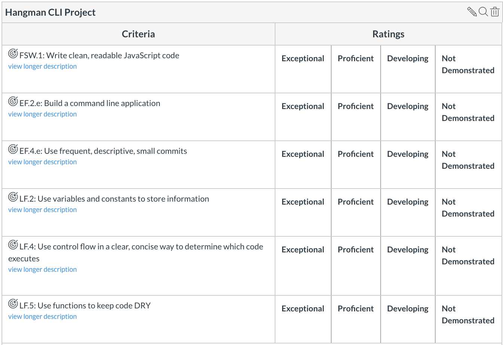

## Command Line Hangman


## Instructions for lab submission

1. Fork the assignment repo
1. Clone your Fork to your machine
1. Complete the lab
1. Push your changes to your Fork
1. Submit a Pull Request back to the assignment repo
1. Paste a link to of your Fork on Canvas and submit

For this assignment, you will build [hangman](http://www.justhangman.com/)  


### Obeject Oriented Programming 
You should build this game in true OOP fashion. To write this game it will be helpful to think about the two players as referee and guesser. If you choose to make both roles interchangable your ComputerPlayer and HumanPlayer will need to have the same method calls available. Think about the following classes that may be helpful. 
1. Board
  * This would construct a board to the length. 
  * It should check if the board is complete. 
  * It should be able to add characters at different indicies. 
2. HumanPlayer 
  * Will need to getMove from player. 
  * Display the board. 
  * Possibly a select secret word that returns the length. 
  * Possibly a givePostioins that returns an array of indicies. 
  * Possibly a reveal word. 
3. ComputerPlayer 
  * Should have a dictionary.
  * Should have secretWord and return it's length. 
  * Should have a reveal. 
  * Should give the positions of guessed characters. 
  * Possibly have a getMove. 
4. Game 
  * Should have guesser and referee. 
  * Should have guesses remaining. 
  * Should have a play function. 
  * Should check for validity of guess. 
  * Should have an isGameOver. 
  
Although all of these methods are not strictly required, they are highly recommened. With OOP it can sometimes be tough to determine which object should truly have responsibilty for what. You are allowed to make adjustments to structure where you see fit. 

## Rubric



## Requirements

1. The user must be able to play against the computer
1. The word that the computer chooses must be random. There is a large array of words below.
1. The user must have a limited number of guesses
1. After each guess, the computer should print out the current state of the word you are guessing.  (ex. A _ _ L E, for apple)
1. After each guess the computer should print out how many guesses you have remaining.
1. The computer should tell the user if she wins, show her how many guesses it took and end the current game
1. The user should see the correct answer if she loses


```js
let allTheWords = ["able", "about", "account", "acid", "across", "addition", "adjustment", "advertisement", "after", "again", "against", "agreement", "almost", "among", "amount", "amusement", "angle", "angry", "animal", "answer", "apparatus", "apple", "approval", "arch", "argument", "army", "attack", "attempt", "attention", "attraction", "authority", "automatic", "awake", "baby", "back", "balance", "ball", "band", "base", "basin", "basket", "bath", "beautiful", "because", "before", "behaviour", "belief", "bell", "bent", "berry", "between", "bird", "birth", "bite", "bitter", "black", "blade", "blood", "blow", "blue", "board", "boat", "body", "boiling", "bone", "book", "boot", "bottle", "brain", "brake", "branch", "brass", "bread", "breath", "brick", "bridge", "bright", "broken", "brother", "brown", "brush", "bucket", "building", "bulb", "burn", "burst", "business", "butter", "button", "cake", "camera", "canvas", "card", "care", "carriage", "cart", "cause", "certain", "chain", "chalk", "chance", "change", "cheap", "cheese", "chemical", "chest", "chief", "chin", "church", "circle", "clean", "clear", "clock", "cloth", "cloud", "coal", "coat", "cold", "collar", "colour", "comb", "come", "comfort", "committee", "common", "company", "comparison", "competition", "complete", "complex", "condition", "connection", "conscious", "control", "cook", "copper", "copy", "cord", "cork", "cotton", "cough", "country", "cover", "crack", "credit", "crime", "cruel", "crush", "current", "curtain", "curve", "cushion", "damage", "danger", "dark", "daughter", "dead", "dear", "death", "debt", "decision", "deep", "degree", "delicate", "dependent", "design", "desire", "destruction", "detail", "development", "different", "digestion", "direction", "dirty", "discovery", "discussion", "disease", "disgust", "distance", "distribution", "division", "door", "doubt", "down", "drain", "drawer", "dress", "drink", "driving", "drop", "dust", "early", "earth", "east", "edge", "education", "effect", "elastic", "electric", "engine", "enough", "equal", "error", "even", "event", "ever", "every", "example", "exchange", "existence", "expansion", "experience", "expert", "face", "fact", "fall", "false", "family", "farm", "father", "fear", "feather", "feeble", "feeling", "female", "fertile", "fiction", "field", "fight", "finger", "fire", "first", "fish", "fixed", "flag", "flame", "flat", "flight", "floor", "flower", "fold", "food", "foolish", "foot", "force", "fork", "form", "forward", "fowl", "frame", "free", "frequent", "friend", "from", "front", "fruit", "full", "future", "garden", "general", "girl", "give", "glass", "glove", "goat", "gold", "good", "government", "grain", "grass", "great", "green", "grey", "grip", "group", "growth", "guide", "hair", "hammer", "hand", "hanging", "happy", "harbour", "hard", "harmony", "hate", "have", "head", "healthy", "hear", "hearing", "heart", "heat", "help", "high", "history", "hole", "hollow", "hook", "hope", "horn", "horse", "hospital", "hour", "house", "humour", "idea", "important", "impulse", "increase", "industry", "insect", "instrument", "insurance", "interest", "invention", "iron", "island", "jelly", "jewel", "join", "journey", "judge", "jump", "keep", "kettle", "kick", "kind", "kiss", "knee", "knife", "knot", "knowledge", "land", "language", "last", "late", "laugh", "lead", "leaf", "learning", "leather", "left", "letter", "level", "library", "lift", "light", "like", "limit", "line", "linen", "liquid", "list", "little", "living", "lock", "long", "look", "loose", "loss", "loud", "love", "machine", "make", "male", "manager", "mark", "market", "married", "mass", "match", "material", "meal", "measure", "meat", "medical", "meeting", "memory", "metal", "middle", "military", "milk", "mind", "mine", "minute", "mist", "mixed", "money", "monkey", "month", "moon", "morning", "mother", "motion", "mountain", "mouth", "move", "much", "muscle", "music", "nail", "name", "narrow", "nation", "natural", "near", "necessary", "neck", "need", "needle", "nerve", "news", "night", "noise", "normal", "north", "nose", "note", "number", "observation", "offer", "office", "only", "open", "operation", "opinion", "opposite", "orange", "order", "organization", "ornament", "other", "oven", "over", "owner", "page", "pain", "paint", "paper", "parallel", "parcel", "part", "past", "paste", "payment", "peace", "pencil", "person", "physical", "picture", "pipe", "place", "plane", "plant", "plate", "play", "please", "pleasure", "plough", "pocket", "point", "poison", "polish", "political", "poor", "porter", "position", "possible", "potato", "powder", "power", "present", "price", "print", "prison", "private", "probable", "process", "produce", "profit", "property", "prose", "protest", "public", "pull", "pump", "punishment", "purpose", "push", "quality", "question", "quick", "quiet", "quite", "rail", "rain", "range", "rate", "reaction", "reading", "ready", "reason", "receipt", "record", "regret", "regular", "relation", "religion", "representative", "request", "respect", "responsible", "rest", "reward", "rhythm", "rice", "right", "ring", "river", "road", "roll", "roof", "room", "root", "rough", "round", "rule", "safe", "sail", "salt", "same", "sand", "scale", "school", "science", "scissors", "screw", "seat", "second", "secret", "secretary", "seed", "seem", "selection", "self", "send", "sense", "separate", "serious", "servant", "shade", "shake", "shame", "sharp", "sheep", "shelf", "ship", "shirt", "shock", "shoe", "short", "shut", "side", "sign", "silk", "silver", "simple", "sister", "size", "skin", "skirt", "sleep", "slip", "slope", "slow", "small", "smash", "smell", "smile", "smoke", "smooth", "snake", "sneeze", "snow", "soap", "society", "sock", "soft", "solid", "some", "song", "sort", "sound", "soup", "south", "space", "spade", "special", "sponge", "spoon", "spring", "square", "stage", "stamp", "star", "start", "statement", "station", "steam", "steel", "stem", "step", "stick", "sticky", "stiff", "still", "stitch", "stocking", "stomach", "stone", "stop", "store", "story", "straight", "strange", "street", "stretch", "strong", "structure", "substance", "such", "sudden", "sugar", "suggestion", "summer", "support", "surprise", "sweet", "swim", "system", "table", "tail", "take", "talk", "tall", "taste", "teaching", "tendency", "test", "than", "that", "then", "theory", "there", "thick", "thin", "thing", "this", "thought", "thread", "throat", "through", "through", "thumb", "thunder", "ticket", "tight", "till", "time", "tired", "together", "tomorrow", "tongue", "tooth", "touch", "town", "trade", "train", "transport", "tray", "tree", "trick", "trouble", "trousers", "true", "turn", "twist", "umbrella", "under", "unit", "value", "verse", "very", "vessel", "view", "violent", "voice", "waiting", "walk", "wall", "warm", "wash", "waste", "watch", "water", "wave", "weather", "week", "weight", "well", "west", "wheel", "when", "where", "while", "whip", "whistle", "white", "wide", "will", "wind", "window", "wine", "wing", "winter", "wire", "wise", "with", "woman", "wood", "wool", "word", "work", "worm", "wound", "writing", "wrong", "year", "yellow", "yesterday", "young"]
```
